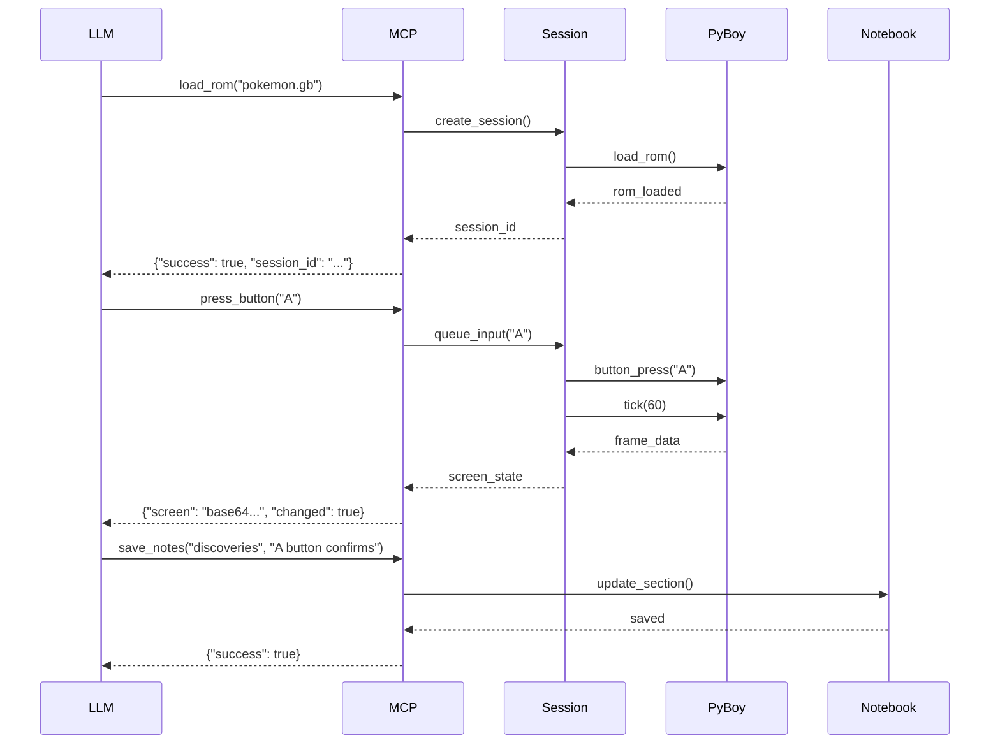
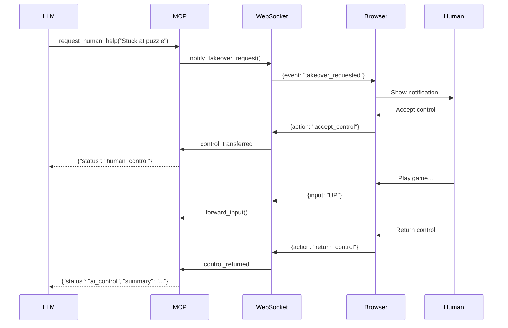

# MCP PyBoy Emulator Server - Technical Architecture

## Architecture Overview

### Core Principles
- **Monolithic Architecture**: Single Python application with clear module boundaries
- **Local-First Design**: Runs entirely on developer/user machine, no cloud dependencies
- **LLM-Optimized**: Code structure and APIs designed for effective LLM interaction
- **Progressive Enhancement**: Start simple, add complexity only when needed
- **Zero-Cost Infrastructure**: Leverages GitHub's free tier for all external services

### High-Level Architecture

```
┌─────────────────────────────────────────────────────────────┐
│                        User Machine                         │
├─────────────────────────────────────────────────────────────┤
│  ┌─────────────┐    ┌──────────────┐    ┌───────────────┐ │
│  │     LLM     │    │  Web Browser │    │   Terminal    │ │
│  │  (Claude)   │    │   (Human)    │    │  (Developer)  │ │
│  └──────┬──────┘    └──────┬───────┘    └───────┬───────┘ │
│         │ stdio            │ HTTP/WS            │         │
│  ┌──────▼──────────────────▼─────────────────────▼───────┐ │
│  │                 MCP PyBoy Server                       │ │
│  ├────────────────────────────────────────────────────────┤ │
│  │  ┌─────────────┐  ┌──────────────┐  ┌──────────────┐ │ │
│  │  │ MCP Handler │  │ Web/WS Server│  │ CLI Interface│ │ │
│  │  └──────┬──────┘  └──────┬───────┘  └──────┬───────┘ │ │
│  │         │                │                  │         │ │
│  │  ┌──────▼────────────────▼─────────────────▼───────┐ │ │
│  │  │           Game Session Manager                   │ │ │
│  │  ├──────────────────────────────────────────────────┤ │ │
│  │  │  ┌─────────┐  ┌──────────┐  ┌────────────────┐ │ │ │
│  │  │  │ PyBoy   │  │ State    │  │ Input Queue    │ │ │ │
│  │  │  │ Engine  │  │ Manager  │  │ & Controller   │ │ │ │
│  │  │  └─────────┘  └──────────┘  └────────────────┘ │ │ │
│  │  └──────────────────────────────────────────────────┘ │ │
│  │                                                        │ │
│  │  ┌────────────────┐  ┌─────────────────────────────┐ │ │
│  │  │ Notebook System│  │ Frontend Static Files       │ │ │
│  │  │ (Markdown)     │  │ (HTML/CSS/JS)              │ │ │
│  │  └────────────────┘  └─────────────────────────────┘ │ │
│  └────────────────────────────────────────────────────────┘ │
│                                                              │
│  ┌────────────────────────────────────────────────────────┐ │
│  │                    Local Filesystem                     │ │
│  │  /roms  /saves  /notebooks  /static  /config          │ │
│  └────────────────────────────────────────────────────────┘ │
└─────────────────────────────────────────────────────────────┘
```

## Technology Stack

### Backend (Python 3.9+)
```toml
# Core Dependencies
mcp = "^1.0.0"              # MCP protocol implementation
pyboy = "^2.0.0"            # Game Boy emulator engine
fastapi = "^0.104.0"        # Web framework with WebSocket support
uvicorn = "^0.24.0"         # ASGI server
pydantic = "^2.0.0"         # Data validation and settings
pillow = "^10.0.0"          # Image processing for screenshots
aiofiles = "^23.0.0"        # Async file operations

# Development Dependencies
pytest = "^7.4.0"           # Testing framework
pytest-asyncio = "^0.21.0"  # Async test support
pytest-mock = "^3.11.0"     # Mocking for tests
black = "^23.0.0"           # Code formatting
ruff = "^0.1.0"             # Linting
mypy = "^1.7.0"             # Type checking
```

### Frontend (Vanilla JS + Modern Web APIs)
- **No Build Tools**: Direct ES modules, no webpack/vite needed initially
- **Web Components**: Custom elements for modularity
- **Canvas API**: For rendering Game Boy screen
- **WebSocket API**: Real-time communication
- **Service Worker**: Optional offline capability
- **CSS Variables**: Theming and responsive design

### Infrastructure (All Free Tier)
- **GitHub Repository**: Source control and project management
- **GitHub Actions**: CI/CD pipeline (2000 minutes/month free)
- **GitHub Pages**: Documentation and demo hosting
- **GitHub Releases**: Binary distribution
- **PyPI**: Python package distribution (free)
- **GitHub Codespaces**: Cloud development environment (60 hours/month)

## Module Architecture

### 1. MCP Server Core (`src/mcp_server/`)
```python
mcp_server/
├── __init__.py
├── server.py          # Main MCP server implementation
├── handlers.py        # Tool handlers mapped to MCP commands
├── protocol.py        # JSON-RPC 2.0 protocol handling
├── registry.py        # Dynamic tool registration system
└── errors.py          # Custom exception classes
```

**Key Design Decisions:**
- Async-first design using asyncio
- Decorator-based tool registration for easy extension
- Comprehensive error handling with LLM-friendly messages
- Type hints throughout for better LLM understanding

### 2. Game Session Manager (`src/game_session/`)
```python
game_session/
├── __init__.py
├── manager.py         # Session lifecycle management
├── emulator.py        # PyBoy wrapper with error handling
├── state.py           # Save state management
├── input_queue.py     # Thread-safe input command queue
└── screen_capture.py  # Efficient frame capture and encoding
```

**Key Features:**
- Singleton session manager to prevent multiple emulators
- Graceful error recovery when emulator crashes
- Memory-efficient screen capture with caching
- Input queue prevents race conditions

### 3. Notebook System (`src/notebook/`)
```python
notebook/
├── __init__.py
├── notebook.py        # Main notebook interface
├── markdown.py        # Markdown parsing and generation
├── storage.py         # File system operations
└── limits.py          # Size and rate limiting
```

**Design Philosophy:**
- Single markdown file per game for simplicity
- Section-based organization with size limits
- Atomic write operations to prevent corruption
- LLM-optimized markdown formatting

### 4. Web Interface (`src/frontend/`)
```python
frontend/
├── __init__.py
├── app.py             # FastAPI application setup
├── websocket.py       # WebSocket connection handler
├── static/
│   ├── index.html     # Single-page application
│   ├── app.js         # Main application logic
│   ├── components/    # Web Components
│   │   ├── game-screen.js
│   │   ├── control-panel.js
│   │   └── notebook-viewer.js
│   └── styles.css     # Responsive design
└── api.py             # REST API endpoints
```

### 5. Shared Utilities (`src/utils/`)
```python
utils/
├── __init__.py
├── config.py          # Configuration management
├── logging.py         # Structured logging setup
├── validators.py      # Input validation helpers
└── async_helpers.py   # Async utility functions
```

## Data Flow Architecture

### 1. LLM → Game Interaction Flow


### 2. Human Takeover Flow


## LLM Best Practices Implementation

### 1. Tool Design Principles
```python
@mcp_tool(
    name="press_button",
    description="Press a Game Boy button with automatic release",
    parameters={
        "button": {
            "type": "string",
            "enum": ["A", "B", "START", "SELECT", "UP", "DOWN", "LEFT", "RIGHT"],
            "description": "The button to press"
        },
        "hold_frames": {
            "type": "integer",
            "default": 1,
            "minimum": 1,
            "maximum": 300,
            "description": "Number of frames to hold the button (default: 1)"
        }
    }
)
async def press_button(button: str, hold_frames: int = 1) -> dict:
    """
    Press a Game Boy button with proper timing.

    Returns:
        dict: Contains 'success' boolean and 'screen' with new state
    """
    # Implementation ensures predictable behavior for LLMs
```

### 2. Progressive Complexity
- **Basic Tools**: Simple, single-action commands (press_button, get_screen)
- **Intermediate Tools**: Compound actions (send_input_sequence)
- **Advanced Tools**: Complex state management (save_state, load_state)

### 3. Error Messages for LLM Recovery
```python
class LLMFriendlyError(Exception):
    """Base class for LLM-friendly errors"""
    def __init__(self, message: str, suggestion: str = None, retry_with: dict = None):
        self.message = message
        self.suggestion = suggestion
        self.retry_with = retry_with
        super().__init__(message)

# Example usage
if not rom_path.exists():
    raise LLMFriendlyError(
        message=f"ROM file not found: {rom_path}",
        suggestion="Use list_roms() to see available ROMs",
        retry_with={"tool": "list_roms", "parameters": {}}
    )
```

### 4. Structured Output Formats
```python
# Consistent response structure across all tools
ResponseModel = {
    "success": bool,
    "data": Optional[Any],     # Tool-specific data
    "error": Optional[str],     # Human-readable error
    "suggestion": Optional[str], # What to try next
    "metadata": {
        "timestamp": float,
        "session_id": str,
        "tool": str,
        "duration_ms": float
    }
}
```

## Development Workflow

### 1. Project Structure for LLM Navigation
```
mcp-pyboy/
├── CLAUDE.md              # Project-specific LLM instructions
├── README.md              # Human-focused documentation
├── ARCHITECTURE.md        # This file - technical reference
├── src/                   # All source code
│   └── [modules]          # Clear module boundaries
├── tests/                 # Comprehensive test suite
│   ├── unit/             # Fast, isolated tests
│   ├── integration/      # Full system tests
│   └── fixtures/         # Test data and mocks
├── scripts/              # Development automation
│   ├── setup_dev.py      # One-command dev setup
│   └── test_mcp.py       # Interactive MCP testing
└── examples/             # Usage examples
    ├── basic_gameplay.py
    └── advanced_automation.py
```

### 2. Type Hints for LLM Understanding
```python
from typing import Optional, Dict, List, Union, Literal
from pathlib import Path
from pydantic import BaseModel, Field

class GameState(BaseModel):
    """Represents the current game state"""
    session_id: str = Field(..., description="Unique session identifier")
    rom_loaded: bool = Field(False, description="Whether a ROM is loaded")
    rom_path: Optional[Path] = Field(None, description="Path to loaded ROM")
    frame_count: int = Field(0, description="Total frames since load")
    is_paused: bool = Field(False, description="Whether emulation is paused")
    human_control: bool = Field(False, description="Whether human has control")

    class Config:
        json_schema_extra = {
            "example": {
                "session_id": "abc123",
                "rom_loaded": True,
                "rom_path": "/roms/pokemon.gb",
                "frame_count": 1800,
                "is_paused": False,
                "human_control": False
            }
        }
```

## Testing Strategy

### 1. Unit Testing with Mocks
```python
# tests/unit/test_emulator.py
import pytest
from unittest.mock import Mock, patch
from mcp_pyboy.game_session import EmulatorWrapper

@pytest.fixture
def mock_pyboy():
    """Mock PyBoy instance for testing without ROMs"""
    with patch('pyboy.PyBoy') as mock:
        instance = Mock()
        instance.tick.return_value = None
        instance.screen.ndarray.return_value = np.zeros((144, 160, 3))
        mock.return_value = instance
        yield instance

async def test_button_press(mock_pyboy):
    """Test button press queuing and execution"""
    emulator = EmulatorWrapper()
    await emulator.press_button("A")
    mock_pyboy.button_press.assert_called_with("A")
    mock_pyboy.tick.assert_called()
```

### 2. Integration Testing
```python
# tests/integration/test_mcp_flow.py
import pytest
from mcp_pyboy import MCPServer

@pytest.mark.integration
async def test_full_game_flow():
    """Test complete LLM interaction flow"""
    server = MCPServer()

    # Load ROM
    response = await server.handle_tool("load_rom", {"rom_path": "test.gb"})
    assert response["success"]

    # Play game
    response = await server.handle_tool("press_button", {"button": "START"})
    assert "screen" in response["data"]

    # Save knowledge
    response = await server.handle_tool("save_notes", {
        "section": "controls",
        "content": "START opens menu"
    })
    assert response["success"]
```

### 3. GitHub Actions CI/CD
```yaml
# .github/workflows/ci.yml
name: CI

on: [push, pull_request]

jobs:
  test:
    runs-on: ubuntu-latest
    strategy:
      matrix:
        python-version: ["3.9", "3.10", "3.11", "3.12"]

    steps:
    - uses: actions/checkout@v3
    - uses: actions/setup-python@v4
      with:
        python-version: ${{ matrix.python-version }}

    - name: Install dependencies
      run: |
        pip install -e ".[dev]"

    - name: Lint with ruff
      run: ruff check src/ tests/

    - name: Type check with mypy
      run: mypy src/

    - name: Test with pytest
      run: pytest tests/ --cov=src/ --cov-report=xml

    - name: Upload coverage
      uses: codecov/codecov-action@v3
```

## Deployment Strategy

### 1. Local Installation (Primary)
```bash
# For users
pip install mcp-pyboy

# For development
git clone https://github.com/username/mcp-pyboy
cd mcp-pyboy
pip install -e ".[dev]"
```

### 2. PyPI Distribution
```toml
# pyproject.toml
[build-system]
requires = ["hatchling"]
build-backend = "hatchling.build"

[project]
name = "mcp-pyboy"
description = "MCP server for Game Boy emulation via PyBoy"
readme = "README.md"
license = "MIT"
classifiers = [
    "Development Status :: 3 - Alpha",
    "Framework :: AsyncIO",
    "Intended Audience :: Developers",
    "Topic :: Games/Entertainment :: Emulators",
]

[project.scripts]
mcp-pyboy = "mcp_pyboy.cli:main"
```

### 3. Documentation Site (GitHub Pages)
```
docs-site/
├── index.html         # Landing page with quick start
├── api.html           # Auto-generated API documentation
├── examples.html      # Interactive examples
└── showcase.html      # Video demos and screenshots
```

## Performance Optimization

### 1. Screen Capture Caching
```python
class ScreenCache:
    def __init__(self, ttl_ms: int = 100):
        self._cache: Optional[bytes] = None
        self._last_frame: int = -1
        self._ttl_ms = ttl_ms

    async def get_screen(self, current_frame: int) -> bytes:
        if current_frame == self._last_frame and self._cache:
            return self._cache

        # Generate new screenshot
        screen_data = await self._capture_screen()
        self._cache = screen_data
        self._last_frame = current_frame
        return screen_data
```

### 2. Async Input Queue
```python
class InputQueue:
    def __init__(self):
        self._queue: asyncio.Queue = asyncio.Queue()
        self._processing = False

    async def add_input(self, button: str, frames: int = 1):
        await self._queue.put((button, frames))
        if not self._processing:
            asyncio.create_task(self._process_queue())

    async def _process_queue(self):
        self._processing = True
        while not self._queue.empty():
            button, frames = await self._queue.get()
            await self._execute_input(button, frames)
        self._processing = False
```

## Security Considerations

### 1. Path Traversal Prevention
```python
def validate_rom_path(rom_path: str) -> Path:
    """Validate and sanitize ROM file paths"""
    path = Path(rom_path).resolve()
    allowed_dirs = [Path("roms").resolve(), Path.home() / "ROMs"]

    if not any(path.is_relative_to(allowed) for allowed in allowed_dirs):
        raise ValueError("ROM path outside allowed directories")

    if not path.suffix.lower() in [".gb", ".gbc"]:
        raise ValueError("Invalid ROM file extension")

    return path
```

### 2. Resource Limits
```python
class ResourceLimiter:
    def __init__(self):
        self.max_sessions = 1  # Single session for MVP
        self.max_save_states = 10  # Per game
        self.max_notebook_size = 50_000  # 50KB per game
        self.max_input_queue = 100  # Prevent DoS
```

## Monitoring and Observability

### 1. Structured Logging
```python
import structlog

logger = structlog.get_logger()

# Usage throughout codebase
logger.info("rom_loaded", rom_path=str(rom_path), size_bytes=rom_size)
logger.error("emulator_crash", error=str(e), last_input=last_input)
```

### 2. Performance Metrics
```python
from time import perf_counter

class PerformanceTracker:
    def __init__(self):
        self.metrics = {
            "tool_calls": {},
            "frame_times": [],
            "websocket_latency": []
        }

    async def track_tool_call(self, tool_name: str):
        start = perf_counter()
        try:
            yield
        finally:
            duration = perf_counter() - start
            self.metrics["tool_calls"].setdefault(tool_name, []).append(duration)
```

## Future Enhancements (Post-MVP)

### Phase 1 Extensions
- ROM metadata extraction and caching
- Advanced save state management with branching
- Turbo mode for faster gameplay sections

### Phase 2 Features
- Multi-emulator support (GBA, NES)
- Cloud save synchronization
- Collaborative sessions

### Phase 3 Advanced
- ML-based sprite recognition
- Automated gameplay recording
- Community knowledge sharing

## Conclusion

This architecture provides a solid foundation for a solo developer to build a professional-grade MCP server that showcases:

1. **Modern Python Development**: Async/await, type hints, dataclasses
2. **Web Technologies**: WebSockets, Web Components, Service Workers
3. **MCP Protocol Mastery**: Proper tool design and error handling
4. **LLM Best Practices**: Clear interfaces, progressive disclosure, structured outputs
5. **Professional Deployment**: CI/CD, documentation, testing

The design prioritizes simplicity and maintainability while demonstrating advanced concepts, perfect for a portfolio project that can be developed incrementally with LLM assistance.
